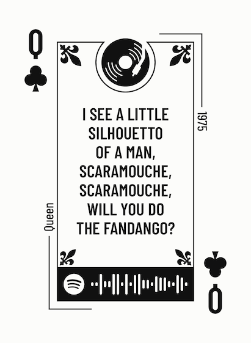

# carded

A tool for creating poker-sized playing cards that show song lyrics and a Spotify code on them.
Used to create gift playing card sets.

**Note:** this project is being done as part of a holiday gift, so it is likely to be rushed, imperfect, and highly specialized.

## Process

1. Specify what should go on each card in a config file (rank, suit, song lyric, artist, year, spotify URI).
2. Use the spotify codes API to get a code for the song from the URI. Use `canvas` library to render onto a temporary canvas.
3. Export that canvas as an image of the correct size.
4. (Future: cache config file to make changes faster.)
5. Manually upload result images to a site like [makeplayingcards.com](https://www.makeplayingcards.com/) to create a deck of cards.

## Spotify Barcode

Spotify barcodes can be created from a song right on the app, but are also available to create from [Spotify Codes](https://www.spotifycodes.com/). 

To read a Spotify barcode, open your Spotify app, go to search, and tap into the search box. To the right of the search box, a camera icon should appear. Tap that camera icon and hold it over the barcode. The song will be found and instantly play.

## Credits

Most icons come from The Noun Project, for which I have a full paid license. Other designs are self-made.

## Example

